# Hi there, I'm OMAR BAHALLOU! 👋

<!-- Theme-Sensitive Header Banner -->

<picture>
  <source media="(prefers-color-scheme: dark)" srcset="readmefile/dark.svg">
  <source media="(prefers-color-scheme: light)" srcset="readmefile/light.svg">
  
</picture>

<br/>

## 🚀 About Me

I’m **OMAR BAHALLOU**, a **Networks, Cloud & Cybersecurity student** passionate about network infrastructure, system security, ethical hacking, and cybersecurity.

I enjoy building and experimenting with secure network environments, analyzing vulnerabilities, automating security tasks, and developing practical cybersecurity solutions. My work combines **network administration, Linux, cybersecurity, cloud technologies, scripting, and security monitoring**.

I’m particularly interested in **network defense, penetration testing, CTF challenges, intrusion detection, infrastructure security, and security automation**. I also enjoy working with virtualized laboratories using **GNS3 and VMware** to simulate realistic enterprise network environments.

> 💡 *"Security is not a product, but a continuous process of learning, testing, and improving."*

* 🌐 **Networks:** Network administration, TCP/IP, routing, switching, VLANs, DNS, DHCP & network troubleshooting.
* 🔐 **Cybersecurity:** Network security, vulnerability analysis, penetration testing, IDS/IPS & security monitoring.
* 🐧 **Systems:** Linux administration, Bash scripting, system hardening & server configuration.
* 🧪 **Cybersecurity Labs:** CTFs, TryHackMe, Web Security Academy, GNS3 & VMware.
* 🛡️ **Security Project:** Enterprise network protection system against DoS and HTTP Loop attacks using **Snort 3, iptables, Python & Flask**.
* ☁️ **Cloud & Virtualization:** Cloud fundamentals, virtual machines, Docker and infrastructure security.
* 🐍 **Programming:** Python, Bash, JavaScript & scripting for automation.
* 🎓 **Education:** Bachelor in **Networks, Cloud & Cybersecurity**.
* 🎯 **Career Goal:** Cybersecurity / Network Security / SOC / Cloud Security.
* 💬 **Ask me about:** Networking, Linux, cybersecurity labs, CTFs, network security or security automation.

---

## 🛠️ Technical Skills

### 🌐 Networking


### 🔐 Cybersecurity


### 🐧 Systems & Virtualization


### 💻 Programming & Scripting


### 🛡️ Security Tools


### ☁️ Cloud & DevOps


---

## 🛡️ Featured Cybersecurity Project

### 🔥 Enterprise Network Protection System

A practical open-source security solution designed to detect and mitigate **DoS and HTTP Loop attacks** in an enterprise network environment.

**Architecture:**

```text
                 ┌──────────────────────┐
                 │      Kali Linux      │
                 │   Attacker Nodes     │
                 └──────────┬───────────┘
                            │
                     GNS3 / VMware
                            │
                            ▼
                 ┌──────────────────────┐
                 │    Ubuntu Server     │
                 │      Layer 2         │
                 │       Bridge         │
                 └──────────┬───────────┘
                            │
             ┌──────────────┼──────────────┐
             ▼              ▼              ▼
          Snort 3        iptables       Python
        Detection       Mitigation    Automation
             │              │              │
             └──────────────┼──────────────┘
                            ▼
                 ┌──────────────────────┐
                 │   Flask Dashboard    │
                 │ Real-Time Monitoring │
                 └──────────────────────┘
```

**Technologies:**

* 🛡️ Snort 3
* 🔥 iptables
* 🐍 Python
* 🐚 Bash
* 🌐 Flask
* 🐧 Ubuntu Server
* 🧪 Kali Linux
* 🖥️ GNS3
* 💻 VMware
* 📊 SQLite

**Detection capabilities:**

* SYN Flood
* UDP Flood
* HTTP Loop attacks
* Real-time alerting
* Automated IP blocking
* Security event monitoring

---

## 🧪 Cybersecurity & CTF

I’m actively developing my offensive and defensive cybersecurity skills through practical labs and CTF challenges.

### Areas of Interest

* 🌐 Web Security
* 🔍 Digital Forensics & Incident Response
* 🔐 Cryptography
* 🧬 Reverse Engineering
* 💣 Binary Exploitation
* 🕵️ OSINT
* 🐧 Linux Privilege Escalation
* 🌐 Network Security
* 🛡️ Blue Team / Defensive Security

### Platforms

* TryHackMe
* PortSwigger Web Security Academy
* SecDojo
* NetAcad
* CTF competitions & cybersecurity labs

---

## 🏆 Achievements & Activities

### 🛡️ CyberDune

**Training Manager — Cybersecurity Club**

Working on cybersecurity learning activities, workshops, practical labs and knowledge sharing.

### 🧩 Team Hidden Investigation

**CTF Member**

Participating in cybersecurity challenges involving web security, cryptography, OSINT, reverse engineering and miscellaneous challenges.

### 🔐 Cryptography

Interested in cryptographic concepts and practical cryptography challenges through CTF environments.

### 🌐 Alpha Byte Network

Technology club focused on developing students' technical skills through workshops, competitions, cybersecurity activities and technology projects.

---

## 📊 GitHub Stats

<p align="center">

  

  

</p>

---

## 🔥 GitHub Streak

<p align="center">

  

</p>

---

## 📈 Contribution Activity

<p align="center">

  

</p>

---

## 🐍 Contribution Snake

<p align="center">

  

</p>

---

## 🏅 Certifications & Learning

Currently developing skills in:

* 🎓 Networks & Cloud
* 🔐 Cybersecurity
* 🛡️ Network Defense
* 🐧 Linux Administration
* 🌐 Web Security
* ☁️ Cloud Security
* 🧪 Penetration Testing
* 🚨 Security Monitoring
* 🐍 Python Security Automation

---

## 🎯 2026 Goals

```text
[████████████████████]  Cybersecurity
[██████████████████░░]  Network Security
[████████████████░░░░]  Cloud Security
[██████████████░░░░░░]  Penetration Testing
[██████████████░░░░░░]  CTF Skills
[████████████░░░░░░░░]  DevSecOps
```

My goal is to become a strong **Cybersecurity & Network Security Engineer**, combining networking, cloud infrastructure, offensive security and defensive security.

---

## 📫 Connect With Me

<p align="center">

<a href="https://github.com/Omar-bahallou">

</a>

<a href="https://www.linkedin.com/in/omar-bahallou-23026b337/">

</a>

</p>

---

<p align="center">
  ⭐ <b>If you find my projects interesting, consider giving them a star!</b> ⭐
</p>

<p align="center">
  <b>Built with curiosity, secured with knowledge, and powered by Linux. 🐧🔐</b>
</p>

<p align="center">
  <sub>© 2026 Omar BL — Networks, Cloud & Cybersecurity</sub>
</p>
